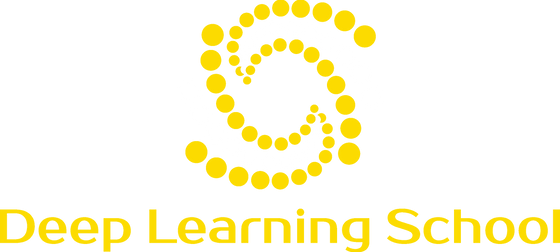

# DLS Course
## Gentle Introduction into Machile Learning
### 2021

Seminars and Lectures are available at appropriate folders

---

## Extra materials

### Prerequisite

#### Probability and statistics

[Math statistics. Stepik course](https://stepik.org/course/326/promo)

[Probability. Stepik course](https://stepik.org/course/3089/syllabus)

[MIPT.Statistics](https://mipt-stats.gitlab.io)

#### Linear Algebra

[Numerical Linear Algebra by FastAI](https://github.com/fastai/numerical-linear-algebra)

[Numerical Linear Algebra by Skoltech](https://github.com/oseledets/nla2021)

[Matrix Cook Book. Formulas for Matrix Differentiation and much more](https://www.math.uwaterloo.ca/~hwolkowi/matrixcookbook.pdf)

#### Basic Libraries for DS

Basic ones are: Numpy, Pandas, Sklearn, Matplotlib, Scipy. Check out their main sites - they are great and have a lot of tutorials

[ScipyLecture Notes](https://scipy-lectures.org) - it is unofficial site, but it has lot of information about each library

[Numpy](https://numpy.org)

[Sklearn](https://scikit-learn.org)

[Pandas](https://pandas.pydata.org)

[Matplotlib](https://matplotlib.org)

---

### Machine learning stuff (Great for beginners)

[ODS. Open Data Science course](https://habr.com/ru/company/ods/blog/322626/)

[Coursera. Courses by Andrew NG](https://www.coursera.org/courses?query=machine%20learning%20andrew%20ng)

[Coursera. Specialization by Yandex & MIPT](https://www.coursera.org/specializations/machine-learning-data-analysis)

---

### DeepLearning

#### Deep Learning Frameworks

[Tensorflow. Deep Learning framework by Google](https://www.tensorflow.org)

[Pytorch. Deep Learning framework by Facebook (Meta). Arguably, the most popular one](https://pytorch.org)

[JAX. Autograd framework by Google](https://github.com/google/jax)

[Keras. High-level framework built on Tensorflow](https://keras.io)

[Pytorch-lightning. High level framework built on Pytorch](https://pytorch-lightning.readthedocs.io/en/latest/)

[Catalyst. High level framework built on Pytorch](https://github.com/catalyst-team/catalyst)

#### Great bor begginers

[Deep Learning School course](https://github.com/DLSchool/deep-learning-school)

[Machine Learning @ MIPT course](https://github.com/girafe-ai/ml-mipt)

[DeepLearningBook. Probably, the greatest book about deep learning](https://www.deeplearningbook.org)

[DiveIntoDeepLearning. Interactive book with lots of practice](https://d2l.ai/chapter_preface/index.html)

[Deep Learning @ NYU](https://atcold.github.io/pytorch-Deep-Learning/)

[CS231n. Computer Vision course @ Standford](http://cs231n.stanford.edu)

[CS224n. NLP course @ Standford](https://web.stanford.edu/class/cs224n/)

#### Advanced stuff

[YSDA. NLP course](https://github.com/yandexdataschool/nlp_course)

[YSDA. CV course](https://github.com/yandexdataschool/deep_vision_and_graphics)

[YSDA. DL course](https://github.com/yandexdataschool/Practical_DL)

[YSDA. RL course](https://github.com/yandexdataschool/Practical_RL)

[Deep RL @ Berkley University](https://rail.eecs.berkeley.edu/deeprlcourse/)

---

### Full Stack Machine Learning Development

[FullStackML course](https://fullstackdeeplearning.com/spring2021/)

[MadeWithML course](https://madewithml.com)

---

### Extra materials

[ODS community. The biggest russian speaking community of ds&ml enthusiasts](https://ods.ai)

[The Batch. ML news forum](https://read.deeplearning.ai/the-batch/)

[Papers with code. A great overview of the recent research in ml field](https://paperswithcode.com)

[TowardsDataScience. Great blog-post about DS&ML (Friendly for beginners)](https://towardsdatascience.com)

---
